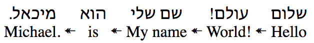

When you want to display interlinear text like so:



Quickstart:
```jsx
import InterlinearSentence from 'interlinear-text-lib';

<InterlinearSentence sentence={[{"en":"Hello","iw":"שלום"},{"en":"World!","iw":"עולם!"},{"en":"My name","iw":"שם שלי"},{"en":"is","iw":"הוא"},{"en":"Michael.","iw":"מיכאל."}]} />
```

English sentence: Hello World! My name is Michael.

Hebrew sentence: שלום עולם! שם שלי הוא מיכאל.

Live Demo available at https://stackblitz.com/edit/react-nyhskt

Here's how you use the component

```JSX
<InterlinearSentence sentence={wordObjectArray} />
```

Here's an example of the JSON needed to build the sentence in the image:

```JSON
[{"en":"Hello","iw":"שלום"},{"en":"World!","iw":"עולם!"},{"en":"My name","iw":"שם שלי"},{"en":"is","iw":"הוא"},{"en":"Michael.","iw":"מיכאל."}]
```
