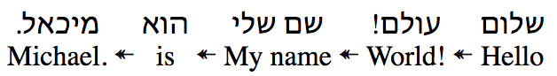

When you want to display interlinear text like so:

English sentence: Hello World! My name is Michael.
Hebrew sentence: שלום עולם! שם שלי הוא מיכאל.

Here's how you use the component

<InterlinearSentence sentence={wordObjectArray} />

Here's an example of the JSON needed to build the sentence above:

[{"en":"Hello","iw":"שלום"},{"en":"World!","iw":"עולם!"},{"en":"My name","iw":"שם שלי"},{"en":"is","iw":"הוא"},{"en":"Michael.","iw":"מיכאל."}]